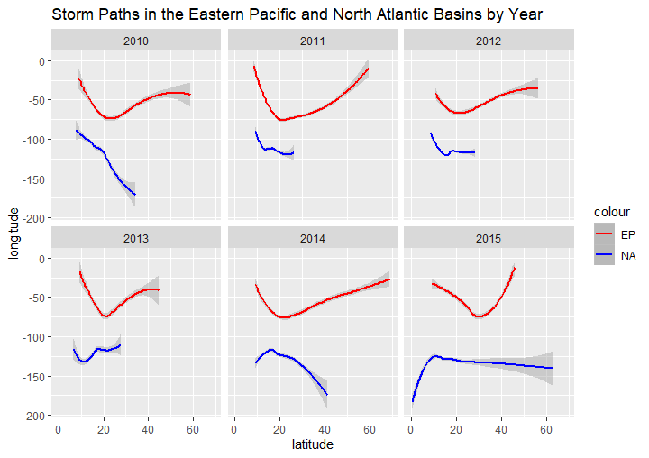
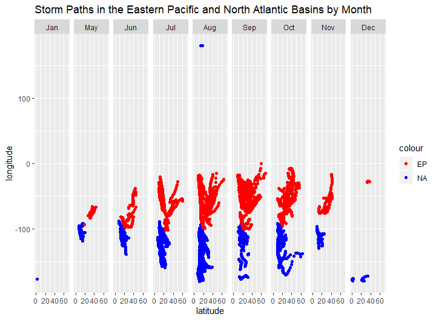
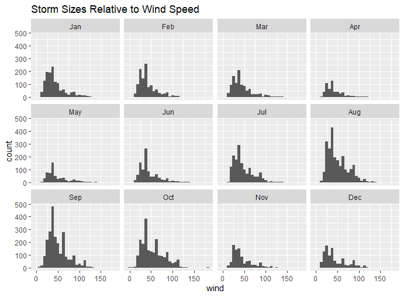
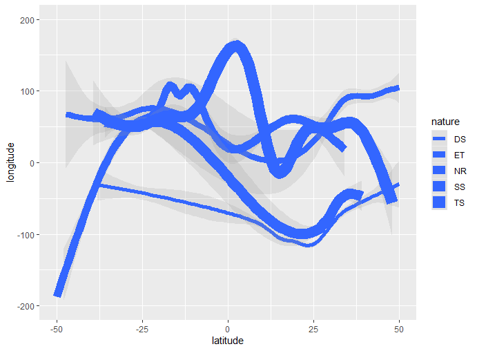
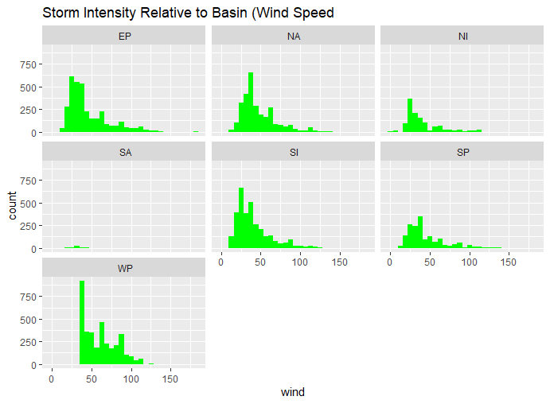
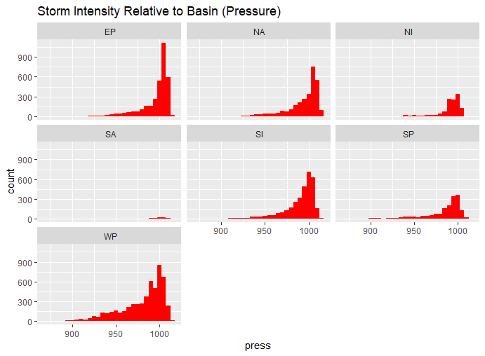

IBTRACS Exploratory Data Analysis: Storms from 2010 to 2015
================
Wyatt Hollister
10/18/2019

## Regional Storm Activity

<!-- -->

### Yearly Storm Paths

The regression curve of the figure above displays the general patterns
of storm pathing in the **Eastern Pacific** (EP) and **North Atlantic**
(NA) storm basins. Based on their movement relative to global
positioning coordinates, we can observe that during the given time
frame, Eastern Pacific storms exhibit relatively little deviation from
their seasonal paths, traversing a relatively even amount both
latitudinally and longitudinally.

Conversely, we can observe that North Atlantic storms are typically very
regionally contained with little net movement, but outlier years such as
2015 demonstrate that these storms are capable of moving great distances
latitudinally - potentially in relation to an increase in winter storms
and hurricanes along the US Eastern seaboard.

<!-- -->

### Monthly Storm Paths

Deconstructing the data further to seasonal storm activity in these
basins, we can observe the alternating behavior of typical *wet* and
*dry* seasons during a given year.

In both the NA and EP basins, storm activity is relatively placid during
the winter and spring months - We can see that the data does not include
any active major storms for the months of February, March, and April,
indicating a particularly weak set of atmospheric conditions in Spring.

During summer and fall months, typically May - October, storm surges are
particularly strong and mobile across these basins. To briefly give
broader context, this behavior trends along with typical global storm
strength as described below.

<!-- -->

We can observe from this data that the *global wet season* - as
described by the strongest sustained storm activity across a multi-month
period - falls in the summer and late summer months, with both an
increased volume of general storms and a slight increase to storms with
wind speeds of 50-100 mph.

### Global Storm Activity By Nature

<!-- -->

### Global Storm Intensity

<!-- -->

<!-- -->

By examining the general storm intensities of all basins globally, we
can observe several key facts.

First, the **Western Pacific** (WP) basin is by far the most active
region for storm activity, both by wind speed and pressure system. In
general, the Pacific Ocean is the most active storm region in the world,
with high wind speeds across both the EP and WP basins and particularly
heavy pressure systems in the **Eastern Pacifc**.

We may also conclude based on the data the interesting observation that
the North Atlantic basin consistently produces storms with low wind
speeds and high pressure systems. Coupled with our previous observation
regarding the relatively lethargic mobility of NA storms, this seems to
indicate that NA storms generally behave as dense, high-intensity
weather systems that linger regionally. Based on anecdotal and
historical evidence, this seems to line up with the previously-mentioned
reputation of punishing East Coast (US) storms and hurricanes.

Finally, we may observe that the **South Atlantic** (SA) basin is one of
the most placid storm regions on Earth, with very few general storms and
almost no high-intensity storms, but is home to occasional high pressure
systems.
